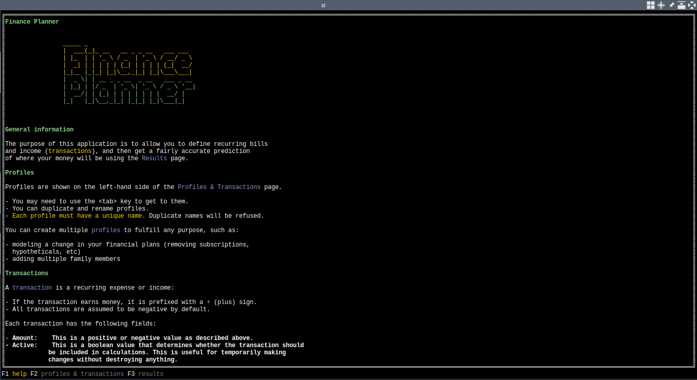
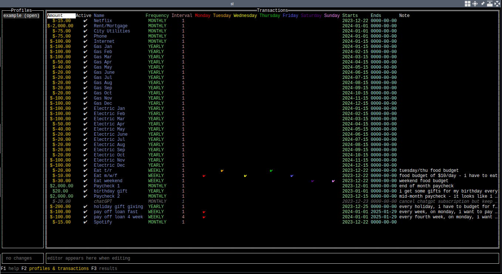

# finance-planner-tui

Define recurring bills & income, and get a fairly accurate prediction of where your finances will be in the future.

This is a terminal user interface-based application (TUI).

## Screenshots

## Features

- uses a simple `yml` configuration format for files
- minimal resource usage footprint (measured around 10-20MB memory usage on Linux)
- sensible default keybindings
- translation support (currently only `en_US.UTF-8` implemented but other languages can create new files under `translations/*.yml`)
- custom color support

## Usage & information

### Profiles

Profiles are shown on the left-hand side of the Profiles & Transactions page.

- You may need to use the `<tab>` key to get to them.
- You can duplicate and rename profiles.
- Each profile must have a unique name. Duplicate names will be refused.

You can create multiple profiles to fulfill any purpose, such as:

- modeling a change in your financial plans (removing subscriptions,
    hypotheticals, etc)
- adding multiple family members

### Transactions

A transaction is a recurring expense or income:

- If the transaction earns money, it is prefixed with a + (plus) sign.
- All transactions are assumed to be negative by default.

Each transaction has the following fields:

- **Amount**: This is a positive or negative value as described above.
- **Active**: This is a boolean value that determines whether the transaction should
  be included in calculations. This is useful for temporarily making
  changes without destroying anything.
- **Name**: This is the human-readable name of the transaction for your eyes.
- **Frequency**: Transactions can occur MONTHLY, WEEKLY, or YEARLY.
  This value must be exactly one of those three strings, but an auto-
  complete is provided to make it quicker.
- **Interval**:  The transaction occurs every `<interval>` WEEKS/MONTHS/YEARS.
- `<Weekday>`: The transaction only occurs on the checked days of the week, and
  will not occur if the defined recurrence pattern does not land on
  one of these days.
- **Starts**: This is the starting date for the transaction's recurrence pattern.
  It is defined as YYYY-MM-DD.

  For simplicity when working with dates at the end of the month,
  you may want to consider putting setting the day value to 28, as
  some recurrence patterns may skip a 31.

  Months range from 1-12, and days range from 1-31.
  Years must be any positive value, and can be 0.
- **Ends**: This is the last acceptable date for recurrence. Behavior is the
 exact same as the Starts field.
- **Note**: A human-readable field for you to put arbitrary notes in.

### Results

The results page allows you to see a projection of your finances into the
future. It shows the following:

- A form on the left containing start & end dates, and the starting balance
for the projection to start with
- A table containing one day per row, with each of the transactions that
occurred on that day, as well as other numbers such as the total expenses,
running balance since the first day of the projection, etc.

The same hotkey that opens the results page can be pressed multiple times to
re-submit the results form and will also show some useful statistics about
your finances.

## Keybindings

Press F1 while in the application or `?` and use the up/down keys to view the keybindings that are activated & defaults. Note that F1 and `?` keybindings can be changed.

## Wish/todo/broken list

- when sorting, the LastSelectedIndex does not seem to work
- fix no sorting for Note column
- weekday sorting only sorts for Monday
- when hitting Enter on a row, if there are other things selected, also select this row
- change all refs to c.Reset to tcell.ColorReset
- debug config.yml loading errors
- create xdg config dir when loading configs
- finish translations into english
- allow disabling mouse support so that things can be copied (config propery, or even through a shortcut?)
- `ctrl+F` and `/` for search
- Home and End keys should navigate to the top left & bottom right columns when already at the leftmost column/row
- write debug logs to xdg cache dir
- remind users that the Tab key is used for navigating through the results form
- update help file to show actual keybindings
- customize colors (later!)
- fix issue on mac with showing black on black in results page
